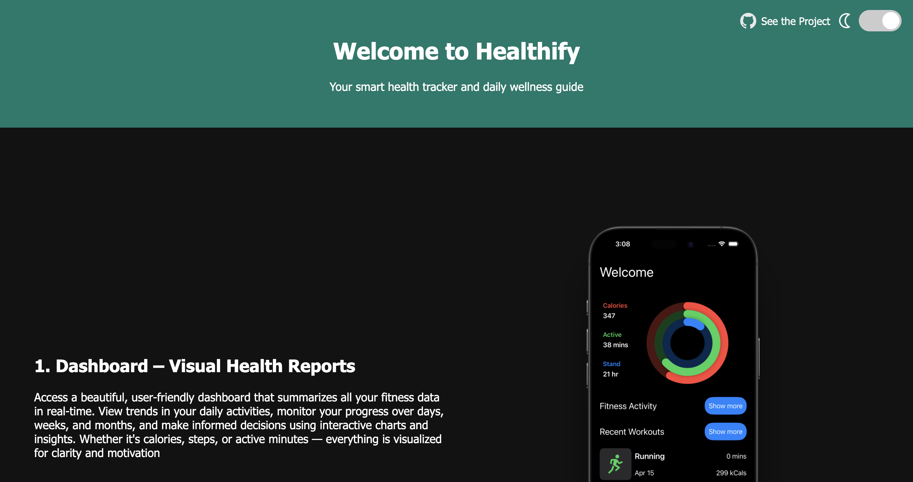
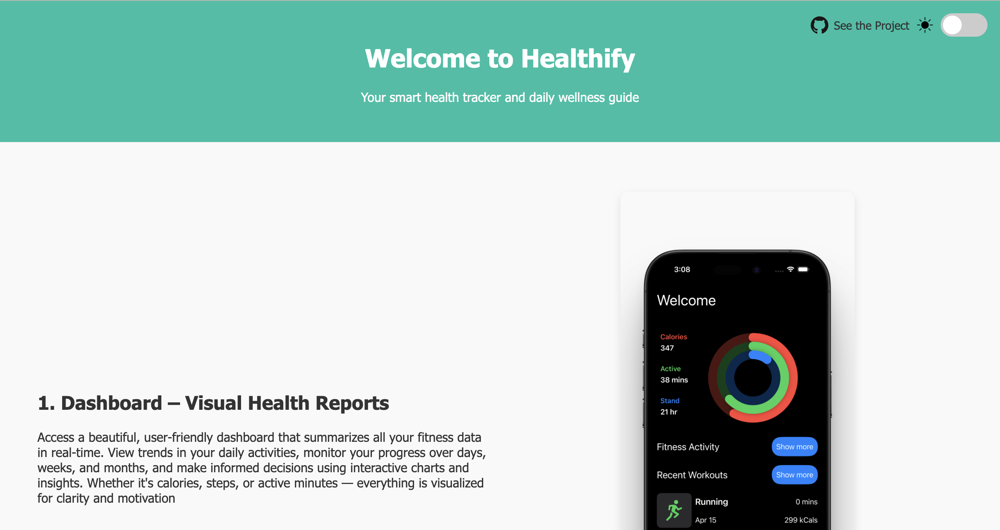

# 🏋️‍♂️ Healthify – Your Health Companion

**Healthify** is a modern health and fitness application designed to help you take full control of your body and performance. From tracking your daily steps to monitoring sports activities and chatting with an AI fitness coach — Healthify does it all in one sleek interface.

---

## 🌐 Landing Page Preview

Here’s a preview of our responsive landing page:

<p align="center">
  
  <br/>
  
</p>

> 📸 *Responsive design with light/dark theme toggle*

---

## 🚀 Features

### 📊 Dashboard – Visual Health Reports  
Stay informed with an intuitive dashboard that displays your health and fitness data in **clear, interactive graphs**. Monitor daily, weekly, and monthly trends in one glance.

### 🧍 Full Body Tracker  
Track crucial body stats such as **weight, BMI, body fat %, muscle mass**, and more. Visualize changes and measure progress with smart analytics and progress indicators.

### ⚽ Sports Activity Tracking  
Automatically detect and log activities like **running, cycling, swimming, gym workouts**, and other sports. View detailed metrics like distance, duration, pace, and calories burned.

### 🔥 Calories & Step Counter  
Stay motivated with accurate, real-time tracking of your **calories burned and steps taken** throughout the day. Set goals and receive reminders to stay on track.

### 🤖 AI-Powered Fitness Chat  
Talk to your own **AI fitness assistant** that can answer questions about workouts, diets, routines, and health goals. Get **personalized suggestions and support 24/7**.

---

## 📱 Tech Stack

- Swift / SwiftUI (iOS)
- HealthKit integration
- CoreData / Firebase for user data
- AI Chat via GPT API or custom ML model

---

## 🔗 GitHub Projects

- 🌐 **Landing Page** (this repo): [https://github.com/shashwat329/healthifywebsite](https://github.com/shashwat329/healthifywebsite)  
- 📱 **iOS App**: [https://github.com/shashwat329/healthify](https://github.com/shashwat329/healthify)

---

## 🛠️ Installation

Clone the landing page:

```bash
git clone https://github.com/shashwat329/healthify
# landingpagehealthify
